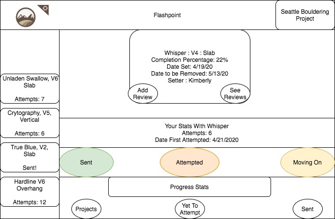

This project was bootstrapped with [Create React App](https://github.com/facebook/create-react-app).

## Available Scripts

In the project directory, you can run:

### `npm start`

Runs the app in the development mode. 
Open [http://localhost:3000](http://localhost:3000) to view it in the browser.

The page will reload if you make edits. 
You will also see any lint errors in the console.

### `npm test`

Launches the test runner in the interactive watch mode. 
See the section about [running tests](https://facebook.github.io/create-react-app/docs/running-tests) for more information.

### `npm run build`

Builds the app for production to the `build` folder. 
It correctly bundles React in production mode and optimizes the build for the best performance.

The build is minified and the filenames include the hashes. 
Your app is ready to be deployed!

See the section about [deployment](https://facebook.github.io/create-react-app/docs/deployment) for more information.

### `npm run eject`

**Note: this is a one-way operation. Once you `eject`, you can’t go back!**

If you aren’t satisfied with the build tool and configuration choices, you can `eject` at any time. This command will remove the single build dependency from your project.

Instead, it will copy all the configuration files and the transitive dependencies (webpack, Babel, ESLint, etc) right into your project so you have full control over them. All of the commands except `eject` will still work, but they will point to the copied scripts so you can tweak them. At this point you’re on your own.

You don’t have to ever use `eject`. The curated feature set is suitable for small and middle deployments, and you shouldn’t feel obligated to use this feature. However we understand that this tool wouldn’t be useful if you couldn’t customize it when you are ready for it.

## Pictures

### Proposal

  Web Application: FlashPoint

  Market: Indoor Climbing Gyms

## Description: 
This Application empowers climbing gyms to better understand the relationship between members and climbs. Gyms input fields regarding their what current climbs they offer  while users report their progress on the climbs. The application provides statistical analyses and visualization of the relationships between climbers and the gyms climbs. 

## Use Cases
	Users are indoor climbing gyms who want to better understand the relationships between members of the gym and the gyms climbs. 

Gyms would input into the application which climbs are currently available at their gym. Along with additional fields such as who set the climb, what grade the climb is, when the climb was set and other metaData. The Gym would then provide their members with the application who would gain access to these fields. 

Members could then log data based on their experience with individual climbs. So a member could log a climb as completed, as attempted, as a project or as flashed. 

The product could then visualize progress for Members, showing their climb progression over time, which climbs they have yet to complete, what is the difficulty range for flashing, what is the range difficulty for projects. Also the application could show when new climbs are incoming and when your project is being taken down! 

The product could visualize data for Gyms. Such as what is the completion rating for a particular climb. What are the most attempted climbs in the gym. What percentage of users are able to complete which range of problems. Which climbs have low completion rates for their grade. Which of your setters are making the most difficult/attempted problems. 

Gyms struggling with retaining members due in part to the plateau of climbing progress that many climbers experience during their climbing careers. This app would help to allow cimbers to visualize this skill progression and seeing incremental progress goes a huge way to staying motivated to climb. Also Gyms use the user data to fine tune their climb setting journey’s. I personally would also just like to know what percentage of each grade at my local gym, I can flash, send, project, or can’t send yet. If I’m going to be honest I’d also like to see what that looks like for my friends who climb at this gym too. Although the application could visualize Leaderboards and other such data, I’m skeptical of presenting any kind of data in a competitive setting. I don’t think high-scores are in step with the bouldering communities approach to the sport and I really admire how cooperative these communities are and wouldn’t want to jeopardize that core concept. 

Both gathering feedback on particular climbs and understanding the relationship between climbs and members. It could also go a long way to creating more consistent and reliable rating systems for a particular gym. The rating system at every gym is unique and subjective. Climbs are primarily graded by their respective setter which is an entirely subjective matter. Many Setter’s have different feelings about what constitutes each grade of climb, it's also nearly impossible to notice trends on the climbs you’ve set outside of extreme examples. The user feedback from this application could help guide setters to align with their members and create a more intune rating system for their gym. 

## Minimum Viable Product
 * User registration (Database)
 * User login/sign-out (Database Aut)
 * Gym registration
 * Gym login/sign-out
 * Gym can create climbs with the following properties: Setter, Grade, Incline, DateSet, DateToRemove
 * Users can log attempts on climbs with the following properties : Completed, Number of Attempts, Feedback
 * DataBase stores Gym and User Data

 * Display for User 
visualization of their current climbing range at the gym
visualization of their grade progression over time
 * Display for Gym
Gym can see the completion rate for the respective climbs
What percentage of users can complete each climb 
How these metrics compare to other climbs of the same grade

## Tools for MVP
 * VisualStudio Code
 * React - Firestore
 * FireBase
 * Jest Testing Framework
 * HTML5
 * CSS
 * Google Charts

Additional Features
Users can form social connections, share their progress and create climbing sessions with other users
Gym can create climbs with the following additional properties: Number of Holds, : Number of Hold Types,
Users can input fields in respect to climbs with the following additional properties :
Flashed
DataBase Stores setters
Display for Setters
All climbs
Current Climbs
Most popular climbs
Respective Climb difficulty vs Gym Climb difficulty
 React Native - to support Mobile development
 When on Iphones users can scan barcodes to get climb information

## Anticipated Challenge
Structuring the Firebase Database
Algorithms to dynamically display data
Transitioning this to a mobile application 
 

